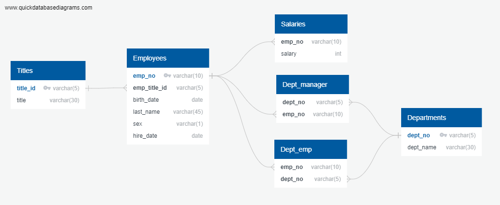
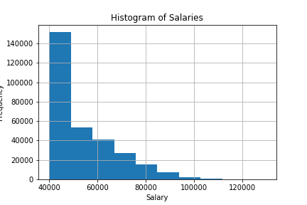

## Background

It is a beautiful spring day, and it is two weeks since you have been hired as a new data engineer at Pewlett Hackard. Your first major task is a research project on employees of the corporation from the 1980s and 1990s. 

1. Data Engineering

2. Data Analysis


#### Data Modeling



#### Data Engineering

* Use the information you have to create a table schema for each of the six CSV files. Remember to specify data types, primary keys, foreign keys, and other constraints.

  * For the primary keys check to see if the column is unique, otherwise create a [composite key](https://en.wikipedia.org/wiki/Compound_key). Which takes to primary keys in order to uniquely identify a row.
  * Be sure to create tables in the correct order to handle foreign keys.

* Import each CSV file into the corresponding SQL table. **Note** be sure to import the data in the same order that the tables were created and account for the headers when importing to avoid errors.

#### Data Analysis


1. List the following details of each employee: employee number, last name, first name, sex, and salary.

```sql
SELECT e.emp_no, e.last_name, e.first_name, e.sex, s.salary
FROM employees e
JOIN salaries s
ON e.emp_no = s.emp_no;
```
2. List first name, last name, and hire date for employees who were hired in 1986.
```sql
SELECT first_name,last_name, hire_date
FROM employees
WHERE hire_date BETWEEN '1986-01-01' AND '1986-12-31'
ORDER BY hire_date asc;

3. List the manager of each department with the following information: department number, department name, the manager's employee number, last name, first name.
```sql
SELECT d.dept_no, d.dept_name, dept_m.emp_no, e.last_name, e.first_name
FROM departments d
JOIN dept_manager dept_m
ON d.dept_no = dept_m.dept_no
JOIN employees e
ON e.emp_no = dept_m.emp_no
ORDER BY dept_no asc;

4. List the department of each employee with the following information: employee number, last name, first name, and department name.
```sql
SELECT dept_m.emp_no, e.last_name, e.first_name, d.dept_name
FROM departments d
JOIN dept_manager dept_m
ON d.dept_no = dept_m.dept_no
JOIN employees e
ON dept_m.emp_no = e.emp_no
ORDER BY d.dept_name asc;

5. List first name, last name, and sex for employees whose first name is "Hercules" and last names begin with "B."
```sql
SELECT last_name, first_name, sex
FROM employees
WHERE first_name = 'Hercules'
AND last_name LIKE 'B%'
ORDER BY last_name asc;

6. List all employees in the Sales department, including their employee number, last name, first name, and department name.
```sql
SELECT d.dept_name, de.emp_no, e.last_name, e.first_name
FROM departments d
JOIN dept_emp de
ON de.dept_no = d.dept_no
JOIN employees e
ON e.emp_no = de.emp_no
WHERE d.dept_name = 'Sales'
ORDER BY de.emp_no asc;

7. List all employees in the Sales and Development departments, including their employee number, last name, first name, and department name.
```sql
SELECT d.dept_name, de.emp_no, e.last_name, e.first_name
FROM departments d
JOIN dept_emp de
ON de.dept_no = d.dept_no
JOIN employees e
ON e.emp_no = de.emp_no
WHERE d.dept_name = 'Sales' OR d.dept_name = 'Development'
ORDER BY e.last_name asc;

8. In descending order, list the frequency count of employee last names, i.e., how many employees share each last name.
```sql
SELECT last_name, COUNT(emp_no)
FROM employees
GROUP BY last_name
ORDER BY count desc;
```
## Bonus (Optional)

As you examine the data, you are overcome with a creeping suspicion that the dataset is fake. You surmise that your boss handed you spurious data in order to test the data engineering skills of a new employee. To confirm your hunch, you decide to take the following steps to generate a visualization of the data, with which you will confront your boss:

1. Import the SQL database into Pandas. (Yes, you could read the CSVs directly in Pandas, but you are, after all, trying to prove your technical mettle.) This step may require some research. Feel free to use the code below to get started. Be sure to make any necessary modifications for your username, password, host, port, and database name:

2. Create a histogram to visualize the most common salary ranges for employees.



3. Create a bar chart of average salary by title.

## Epilogue

Evidence in hand, you march into your boss's office and present the visualization. With a sly grin, your boss thanks you for your work. On your way out of the office, you hear the words, "Search your ID number." You look down at your badge to see that your employee ID number is 499942.

__APRIL FOOLSDAY :)__